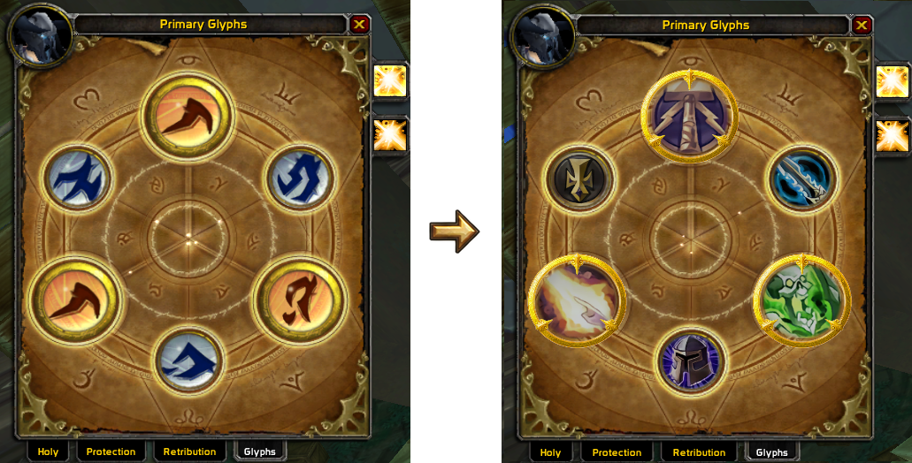
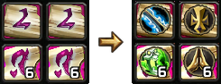

# EasyGlyph

Small QoL addon for WotLK 3.3.5a for people who swap glyphs a lot like arena tryhards, parsing tryhards, or anyone tired of hovering the same glyphs over and over.

## Preview

## What it does

- replaces the default glyph visuals with recognizable spell/ability icons
- replaces glyph item icons in bags, vendors, AH and other common item views
- keeps the main glyph frame clean and easy to read at a glance

## Why is the addon this big?

The code itself is tiny. Almost all of the size comes from the custom icon textures.

I kept the important icons at higher/lossless quality so the large glyph-frame icons stay smooth instead of looking heavily compressed or pixelated.
